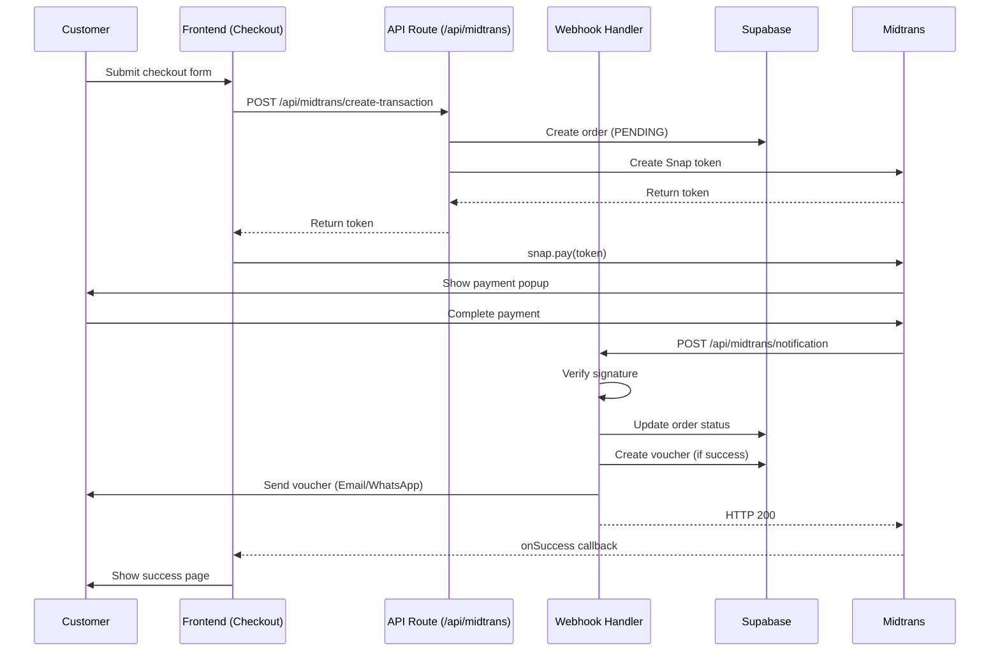

# Design Document: Midtrans Payment Integration

## Overview

Dokumen ini menjelaskan desain teknis untuk integrasi Midtrans Payment Gateway ke platform Kalanara Spa Voucher. Integrasi menggunakan Midtrans Snap untuk payment UI dan webhook untuk payment notification handling.

### Goals
- Mengganti simulasi pembayaran dengan payment gateway real
- Support berbagai metode pembayaran Indonesia (kartu kredit, bank transfer, e-wallet)
- Secure webhook handling dengan signature verification
- Voucher creation hanya setelah payment confirmed

### Non-Goals
- Refund automation (handle manual via Midtrans Dashboard)
- Subscription/recurring payments
- Multi-currency support (IDR only)

## Architecture



## Components and Interfaces

### 1. Midtrans Configuration (`lib/midtrans/config.ts`)

```typescript
interface MidtransConfig {
  isProduction: boolean;
  serverKey: string;
  clientKey: string;
  merchantId: string;
}

// Environment variables:
// MIDTRANS_SERVER_KEY - Server key (server-side only)
// NEXT_PUBLIC_MIDTRANS_CLIENT_KEY - Client key (exposed to frontend)
// MIDTRANS_IS_PRODUCTION - "true" for production
```

### 2. Create Transaction API (`app/api/midtrans/create-transaction/route.ts`)

```typescript
interface CreateTransactionRequest {
  serviceId: string;
  customerName: string;
  customerEmail: string;
  customerPhone: string;
  recipientName: string;
  recipientEmail?: string;
  recipientPhone: string;
  senderMessage?: string;
  deliveryMethod: DeliveryMethod;
  sendTo: SendTo;
}

interface CreateTransactionResponse {
  success: boolean;
  token?: string;
  orderId?: string;
  error?: string;
}
```

### 3. Webhook Handler (`app/api/midtrans/notification/route.ts`)

```typescript
interface MidtransNotification {
  transaction_time: string;
  transaction_status: string;
  transaction_id: string;
  status_code: string;
  signature_key: string;
  order_id: string;
  merchant_id: string;
  gross_amount: string;
  fraud_status?: string;
  payment_type: string;
}

// Signature verification:
// SHA512(order_id + status_code + gross_amount + ServerKey)
```

### 4. Snap Integration Hook (`hooks/useMidtransSnap.ts`)

```typescript
interface UseSnapOptions {
  onSuccess?: (result: SnapResult) => void;
  onPending?: (result: SnapResult) => void;
  onError?: (result: SnapResult) => void;
  onClose?: () => void;
}

interface UseSnapReturn {
  pay: (token: string) => void;
  isLoading: boolean;
}
```

### 5. Order Actions (`lib/actions/orders.ts` - Extended)

```typescript
// New functions to add:
createPendingOrder(data: PendingOrderData): Promise<Order>
updateOrderPaymentStatus(orderId: string, status: PaymentStatus, midtransData: MidtransPaymentData): Promise<boolean>
getOrderByMidtransOrderId(midtransOrderId: string): Promise<Order | null>
```

## Data Models

### Database Schema Changes

```sql
-- Add new columns to orders table
ALTER TABLE orders ADD COLUMN midtrans_order_id VARCHAR(255) UNIQUE;
ALTER TABLE orders ADD COLUMN midtrans_transaction_id VARCHAR(255);
ALTER TABLE orders ADD COLUMN midtrans_payment_type VARCHAR(50);
ALTER TABLE orders ADD COLUMN midtrans_transaction_time TIMESTAMP;

-- Create index for webhook lookups
CREATE INDEX idx_orders_midtrans_order_id ON orders(midtrans_order_id);
```

### Updated Order Type

```typescript
interface Order {
  // Existing fields...
  id: string;
  voucher_id: string | null; // Now nullable, set after payment success
  customer_email: string;
  customer_name: string;
  customer_phone: string;
  payment_method: PaymentMethod;
  payment_status: PaymentStatus;
  total_amount: number;
  created_at: string;
  
  // New Midtrans fields
  midtrans_order_id: string;
  midtrans_transaction_id: string | null;
  midtrans_payment_type: string | null;
  midtrans_transaction_time: string | null;
}
```

### Pending Order Data (for checkout initiation)

```typescript
interface PendingOrderData {
  service_id: string;
  customer_email: string;
  customer_name: string;
  customer_phone: string;
  recipient_name: string;
  recipient_email?: string;
  recipient_phone: string;
  sender_message?: string;
  delivery_method: DeliveryMethod;
  send_to: SendTo;
  total_amount: number;
}
```


## Correctness Properties

*A property is a characteristic or behavior that should hold true across all valid executions of a system-essentially, a formal statement about what the system should do. Properties serve as the bridge between human-readable specifications and machine-verifiable correctness guarantees.*

Based on the prework analysis, the following properties have been identified. Redundant properties have been consolidated.

### Property 1: Signature Verification Correctness
*For any* webhook notification payload, the signature verification function SHALL return true if and only if the computed SHA512 hash of `order_id + status_code + gross_amount + ServerKey` matches the provided `signature_key`.
**Validates: Requirements 3.1, 3.5**

### Property 2: Transaction Status Mapping
*For any* valid webhook notification, the order status SHALL be updated according to the following mapping:
- `settlement` or `capture` with `fraud_status` = `accept` → COMPLETED
- `deny`, `cancel`, or `expire` → FAILED
- `pending` → PENDING (no change)
**Validates: Requirements 3.2, 3.3, 3.4**

### Property 3: Idempotent Webhook Processing
*For any* webhook notification, processing the same notification multiple times SHALL produce the same final order state as processing it once.
**Validates: Requirements 6.4**

### Property 4: Order ID Uniqueness
*For any* sequence of order creations, each generated `midtrans_order_id` SHALL be unique across all orders in the system.
**Validates: Requirements 2.5**

### Property 5: Voucher Creation Precondition
*For any* order, a voucher SHALL be created if and only if the order's `payment_status` is COMPLETED.
**Validates: Requirements 8.2, 8.3**

### Property 6: Transaction Request Completeness
*For any* valid checkout data, the Midtrans transaction request SHALL contain `order_id`, `gross_amount`, and `customer_details` fields.
**Validates: Requirements 2.2**

### Property 7: Pending Order Initialization
*For any* checkout initiation, an order SHALL be created with `payment_status` = PENDING and `voucher_id` = null before the Snap token is generated.
**Validates: Requirements 8.1, 7.1**

### Property 8: Webhook Response Consistency
*For any* successfully processed webhook (valid signature, order exists), the handler SHALL respond with HTTP status 200.
**Validates: Requirements 3.6**

## Error Handling

### API Errors

| Error Type | HTTP Status | Response | Action |
|------------|-------------|----------|--------|
| Missing required fields | 400 | `{ error: "Missing required field: {field}" }` | Return error to frontend |
| Service not found | 404 | `{ error: "Service not found" }` | Return error to frontend |
| Midtrans API error | 502 | `{ error: "Payment service unavailable" }` | Log error, return generic message |
| Midtrans timeout | 504 | `{ error: "Payment service timeout" }` | Log error, suggest retry |
| Database error | 500 | `{ error: "Internal server error" }` | Log error, return generic message |

### Webhook Errors

| Error Type | HTTP Status | Action |
|------------|-------------|--------|
| Invalid signature | 200 | Log security event, do not process |
| Order not found | 200 | Log event, respond OK (prevent retries) |
| Database error | 500 | Log error, Midtrans will retry |
| JSON parse error | 400 | Log error, Midtrans will retry |

### Frontend Error Handling

```typescript
// Snap callback error handling
snap.pay(token, {
  onSuccess: (result) => {
    // Redirect to success page
    // Note: Always verify via webhook, don't trust frontend callback alone
  },
  onPending: (result) => {
    // Show pending instructions
    // Store order ID for status checking
  },
  onError: (result) => {
    // Show error message
    // Allow retry
  },
  onClose: () => {
    // User closed popup without completing
    // Maintain form state, allow retry
  }
});
```

## Testing Strategy

### Unit Testing Framework
- **Framework**: Vitest (already configured in project)
- **Mocking**: vi.mock for external dependencies

### Property-Based Testing Framework
- **Framework**: fast-check
- **Minimum iterations**: 100 per property

### Test Categories

#### 1. Unit Tests
- Signature verification function
- Order ID generation
- Transaction status mapping
- Request payload construction

#### 2. Property-Based Tests
Each correctness property will have a corresponding property-based test:

```typescript
// Example: Property 1 - Signature Verification
import fc from 'fast-check';

describe('Signature Verification', () => {
  it('should verify valid signatures', () => {
    fc.assert(
      fc.property(
        fc.string(), // order_id
        fc.string(), // status_code
        fc.nat(),    // gross_amount
        fc.string(), // server_key
        (orderId, statusCode, grossAmount, serverKey) => {
          const signature = computeSignature(orderId, statusCode, grossAmount.toString(), serverKey);
          return verifySignature({ order_id: orderId, status_code: statusCode, gross_amount: grossAmount.toString(), signature_key: signature }, serverKey);
        }
      ),
      { numRuns: 100 }
    );
  });
});
```

#### 3. Integration Tests
- API route handlers with mocked Midtrans
- Webhook handler with mocked database
- End-to-end checkout flow (manual testing)

### Test File Structure

```
lib/
  midtrans/
    __tests__/
      signature.test.ts      # Property 1
      status-mapping.test.ts # Property 2
      order-id.test.ts       # Property 4
    config.ts
    signature.ts
    types.ts

app/api/midtrans/
  __tests__/
    create-transaction.test.ts  # Property 6, 7
    notification.test.ts        # Property 3, 5, 8
```

## Security Considerations

1. **Server Key Protection**: Never expose `MIDTRANS_SERVER_KEY` to frontend
2. **Signature Verification**: Always verify webhook signatures before processing
3. **HTTPS Only**: Webhook endpoint must use HTTPS
4. **Idempotency**: Prevent duplicate order processing
5. **Input Validation**: Validate all incoming data
6. **Error Messages**: Don't expose internal details in error responses

## Environment Variables

```env
# Midtrans Configuration
MIDTRANS_SERVER_KEY=Mid-server-xxxxx          # Server-side only
NEXT_PUBLIC_MIDTRANS_CLIENT_KEY=Mid-client-xxxxx  # Exposed to frontend
MIDTRANS_IS_PRODUCTION=false                  # "true" for production

# Existing variables (unchanged)
NEXT_PUBLIC_SUPABASE_URL=
NEXT_PUBLIC_SUPABASE_ANON_KEY=
SUPABASE_SERVICE_ROLE_KEY=
RESEND_API_KEY=
NEXT_PUBLIC_APP_URL=
```
